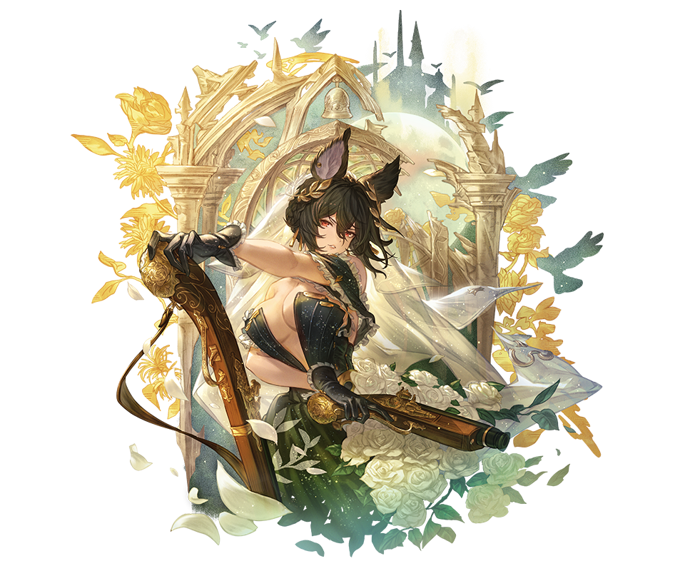
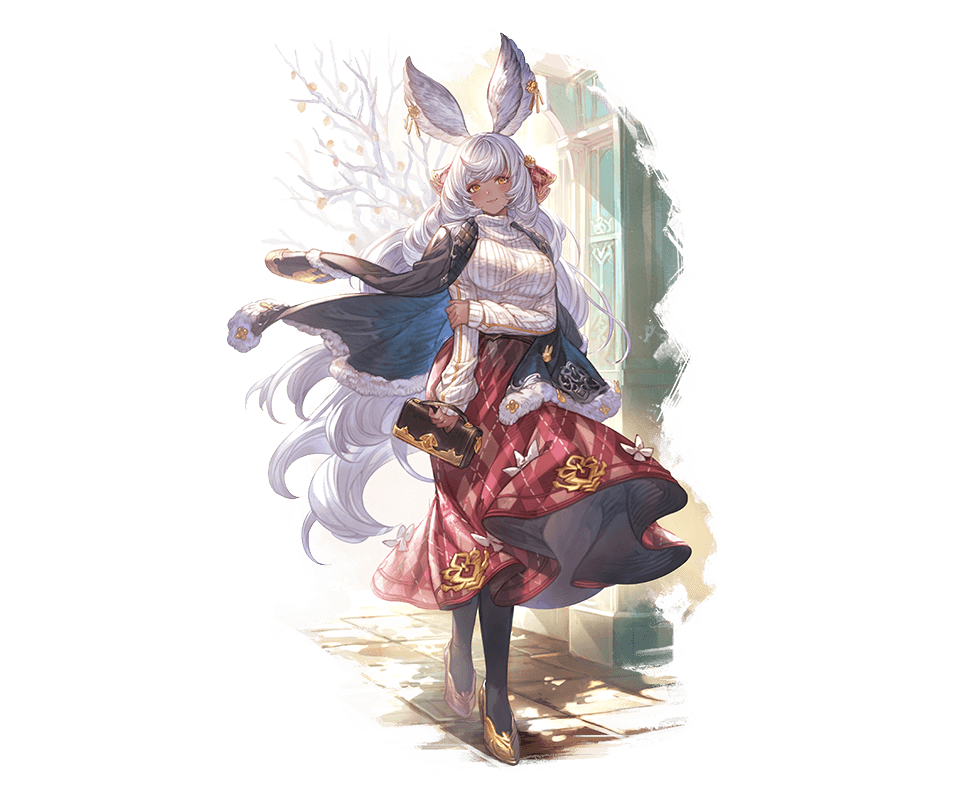

## Hail and Well Met! 👋

Welcome to my humble abode and and storage for all things code. Take a look around while you're here and come back again to see if anything changed. I'm a freelancer developer, aspiring game dev, and full-time seeker of knowledge. Thanks for visiting and if you want to reach out I can be found [here](https://www.linkedin.com/in/faizu-adam).

## About Me

<!---->

  


<!--https://gbf.wiki/Ilsa_(Formal)#/media/File:Npc_zoom_3040599000_02.png

-->
## More About Me

```yaml
name: Faizu Adam
location: Maryland
current_job: Freelance Developer
education: [
  School: "Capitol Technology University",
  Awards: "Magna Cum Laude", "Dean's List",
  Degree: "Bachelor's in Computer Science"
]

fields_of_interest: [
  "Backend Development",
  "Database Management",
  "Game Development",
  "Data Science"
]

technical_background: [
  "Frontend Developer Intern"
  "Software Engineer Intern"
]

currently_learning: ["Unity", "Docker", "AWS", "Malware"]
2025_goals: ["Create 5 Unity Projects", "Be Consistent", "Remastering the Fundamentals"]
hobbies: ["Gaming", "Reading", "Art"]
```

<h2> &nbsp;Some Tools I Have Used and Learned</h2>
<p align="left">


</p>


            
          
          
